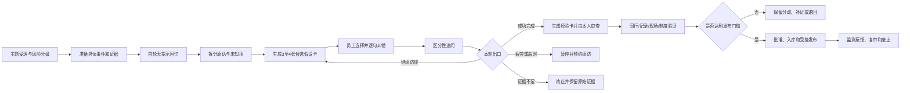

# AI辅助经验萃取与知识入库 SOP（试点版 v1.0）

## 1. 目的

本流程用于把一线员工难以完整表述的现场经验，转化为可追溯、可反驳、可验证、可发布的知识对象，并供工厂知识库、培训助手或AI客服使用。

本流程的基本定位是“AI辅助经验外化”，不是让AI自动生成组织事实。

核心责任分工：

> AI负责扩展可能性；员工负责确认亲身经历；外部证据负责确定事实；组织流程负责决定能否发布。

## 2. 适用范围与禁区

### 2.1 优先试点场景

- 高频、低至中风险、结果容易核验的常见故障排查；
- 换型、调机、交接班中的局部技巧；
- 外观缺陷、异常声音、常见报警的识别线索；
- 客服中的客户表达变体、诊断追问、常见解决路径和升级信号；
- 新员工经常犯错，但现有SOP解释不足的环节。

### 2.2 不得仅凭本流程直接发布的内容

- 安全联锁、应急处置、化学品、电气、高温高压及设备控制操作；
- 精确参数、质量上下限、设备额定值和法定标准；
- 价格、保修、赔付、合同、法规及对客户的正式承诺；
- 罕见重大事故的单人因果判断；
- 与现行SOP、工艺文件或监管要求冲突的经验。

上述内容只能作为“问题线索”进入正式审核，不得直接指导生产或面向客户。

## 3. 七条强制原则

1. AI新增的任何内容默认是“待验证假设”，不得写成既定事实。
2. “员工选中”不等于“员工确认”，“员工确认”不等于“事实证实”，“事实证实”不等于“批准发布”。
3. 原始录音、转写、图片、日志和员工原话只追加、不覆盖，最终文本必须能回溯到来源。
4. 审核以命题和句子为单位，不以整篇文章一次性点“同意”为准。
5. 正式制度和权威系统优先；经验知识只能补充判断线索、边界、例外和语言表达。
6. 风险阻断、状态升级、索引隔离和权限控制必须由程序规则执行，不得依靠同一个生成模型自我审核。
7. 原始材料实行最小采集、用途隔离和限期保存，不得回流个人绩效考核或供应商模型训练。

## 4. 角色与职责

| 角色 | 主要职责 | 不得兼任或越权事项 |
|---|---|---|
| 项目负责人 | 选择场景、确定用途与风险、配置资源、批准试点范围 | 不直接替代专业审核人批准高风险知识 |
| 受访员工 | 提供具体经历、辨认和修正候选、说明不确定性 | 不承担AI生成内容的真实性责任 |
| 访谈主持人 | 建立信任、控制节奏、处理语音或设备问题 | 不诱导员工选择某个候选 |
| AI访谈助手 | 拆解原话、生成竞争假设、提出区分性问题、生成草稿 | 不宣布事实已经确认，不自动发布 |
| 证据审计人 | 对照原始材料逐条检查命题是否被证据支持 | 审计时不以所选故事的流畅度作为依据 |
| 同岗位复核人 | 独立判断适用性，提供相反案例或分歧 | 复核前不查看受访者身份和最终结论为佳 |
| 领域审核人 | 由班组长、工艺、维修、质量或客服政策负责人担任 | 不以语言是否专业代替证据审核 |
| EHS/合规审核人 | 审核安全、法规、隐私和承诺风险 | 高风险内容未经其批准不得发布 |
| 知识管理员 | 管理版本、证据链、权限、有效期、撤回和发布 | 不得把“候选知识”放入生产知识库 |
| 数据责任人 | 管理授权、脱敏、保留期、访问审计和删除请求 | 不得将访谈日志提供给个人绩效系统 |

## 5. 知识状态

| 状态 | 定义 | 可见范围 |
|---|---|---|
| 原始证据 | 员工原话、录音、照片、日志等未加工材料 | 授权项目组 |
| AI假设 | AI提出但尚未由员工核验的内容 | 当前访谈及审核人员 |
| 候选知识 | 员工逐句确认、修正或补充过的内容 | 内部验证区 |
| 已验证知识 | 已获同行、记录、现场观察或权威文件支持 | 内部专家和影子测试 |
| 已批准知识 | 经过对应风险级别审核，可供正式检索和回答 | 获授权用户或客户 |
| 已废止知识 | 过期、冲突、错误或被新版替代 | 仅审计可见，不再召回 |

系统不得跳级。尤其禁止从“AI假设”或“候选知识”直接进入正式RAG。

状态以命题为最小单位。经验卡只允许发布其中已经批准的命题；如必须整卡发布，整卡状态和风险取其中最严格的一项。批准必须同时绑定渠道和受众，例如“内部培训可用”不自动等于“现场操作可用”或“客户回答可用”。

### 5.1 必须由系统实现的硬控制

- 原始证据区、候选验证区和生产知识索引物理或逻辑隔离，使用不同服务账号和访问权限；
- 只有指定审核角色可以改变验证状态，生成模型没有状态升级权限；
- 入库接口逐项检查风险、证据、审批、适用范围、版本和发布渠道，任一字段缺失即失败关闭；
- 未批准、高风险待审、已过期和已废止内容不得进入生产检索索引；
- 所有状态变更记录操作者、时间、原因、模型与提示词版本，历史版本不可覆盖；
- 发现违规生成时，从员工选择界面阻断该命题，但保留隔离的审计副本，不做无痕删除；
- 定期用测试账号验证越权检索、过期召回和跨渠道泄漏均被阻断。

## 6. 端到端流程



### 6.1 步骤0：主题受理与风险分级

**负责人：** 项目负责人、领域审核人  
**用时：** 每个主题5至10分钟  
**输入：** 业务痛点、事故或工单记录、培训问题、客服未解决案例。

操作：

1. 将主题缩小到一个具体任务，例如“某型号设备出现E17报警后的初步排查”，不要使用“维修经验总结”这类宽泛题目。
2. 明确知识将用于培训、内部检索、现场建议还是客户回答。
3. 查明是否已有SOP、MES、QMS、PLM、CRM或政策系统等权威来源。访谈不替代这些事实来源，但允许员工报告文件遗漏、执行障碍和制度与现场不一致之处。
4. 依据下列矩阵把主题及其中每个命题分为低、中、高风险。
5. 指定领域审核人、预计有效期和禁止发布范围。

**输出：主题任务卡。** 必填字段包括任务名称、设备或产品、目标用户、使用场景、风险级别、权威来源、审核人、截止日期。

**准入门：** 首批试点只选择高频、低至中风险且能从结果记录中验证的主题。

风险评分采用 `严重度S × 发生可能性L × 难检测性D`：

| 因子 | 1级 | 2级 | 3级 | 4级 |
|---|---|---|---|---|
| 严重度S | 无操作后果，文字或术语偏差 | 可逆返工、轻微时效损失 | 质量损失、较大停机、隐私或客户权益影响 | 人身安全、重大质量、法规、合同或重大客户承诺 |
| 可能性L | 极少发生 | 偶尔发生 | 重复发生 | 高频发生 |
| 难检测性D | 执行前即可发现 | 执行后容易发现 | 延迟或较难发现 | 无明显信号或发现时已造成后果 |

总分不高于6且S不高于2为低风险；7至18为中风险；19以上为高风险。任何S=4的命题直接判为高风险，S=3至少为中风险；信息不足、评级争议或同卡混合风险时一律取较高等级，由领域审核人裁决。

访谈不能替代权威事实来源，但员工报告的“制度要求与现场现实不一致”必须原样记录，单独进入流程改进或合规调查通道，不得因已有文件而压制该信息。

### 6.2 步骤1：访谈准备

**负责人：** 访谈主持人  
**用时：** 5分钟。

操作：

1. 邀请最近三个月内亲自处理过该任务的员工，优先覆盖不同班次、设备、材料和熟练程度。
2. 准备可帮助回忆的真实材料，例如故障工单、部件照片、样件、音频、短视频或报警时间线。
3. 告知员工：访谈用于改善知识和培训，不以回答是否“标准”评价个人绩效；可以拒绝所有AI候选。
4. 获得录音、转写和内部使用授权，说明保存期限、访问范围、撤回或更正渠道。
5. 避免直接主管在场，降低迎合性回答。
6. 原始音视频、客户通话、照片和工单进入模型前先做数据最小化和脱敏；供应商合同或技术配置必须禁止训练复用，明确存储区域、加密、删除和访问审计要求。
7. 将原始访谈库与绩效、人事系统进行权限和接口隔离，只允许查看汇总后的流程改进指标。
8. 主持人先完成30至60分钟短训和一次模拟校准，使用统一开场词；禁止替员工补句、赞扬某个选择或用语气暗示正确答案。项目组抽检至少10%的访谈。

**异常处理：** 如果员工没有亲历案例，改为记录“听说的信息”，或更换受访者；不得把间接听闻伪装为个人经验。

主持人统一开场词：

> 今天不是考你会不会讲标准答案，也不评价个人绩效。我们想了解你亲自遇到的具体情况。AI稍后会给出几种可能说法，它们都只是猜测，可能全部不对。你可以说“不对”“看情况”“我不确定”，指出错误比同意AI更有价值。未经后续验证和审核的内容不会直接指导生产或回答客户。现在请从最近一次真实经历开始讲。

### 6.3 步骤2：首轮无提示回忆

**负责人：** AI访谈助手，主持人仅在必要时协助  
**建议用时：** 5至7分钟。

AI一次只问一个问题，按以下顺序进行：

1. “请回忆最近一次发生这件事，当时在什么设备、产品或客户情境下？”
2. “你最先看到、听到、闻到、摸到或从数据上发现了什么？”
3. “你做的第一个动作是什么？之后又发生了什么？”
4. “你通过什么现象确认处理有效或无效？”
5. “如果是新人，他最容易在哪一步判断错？”

首轮禁止：

- 在员工自由回忆前给出候选答案；
- 使用“你是不是因为……”等带结论的问题；
- 把模糊词直接转换成精确数值；
- 员工尚未说明时，自行补充原因、顺序或结果。
- 要求员工为了回答而重新触摸、闻嗅、靠近、拆卸设备或绕过任何防护。感官问题只用于回忆既往的安全观察。

**最低信息门槛：** 至少获得一个具体情境、一个可观察线索、一个实际动作和一个结果。未达到时，使用工单或图片进行事件回放；仍无法获得时终止本次主题，不生成完整故事。

**转写确认关卡：** 在生成候选前，系统回放或朗读低置信片段，并优先确认设备编号、产品型号、数值、单位、否定词、先后顺序和方言术语。员工可语音纠正或指认图片。未确认的低置信片段标记为 `TRANSCRIPT_UNCERTAIN`，不得作为已确认骨架或触发具体操作建议。

### 6.4 步骤3：原话拆解与未知项识别

**负责人：** AI访谈助手  
**用时：** 自动处理30至60秒。

AI把材料拆成独立命题，不得润色成统一故事。每条命题记录：

- 命题编号；
- 类型：情境、线索、动作、判断、结果、例外或风险；
- 原始表述及时间戳；
- 来源：员工主动说出、员工推测、听他人说、AI新增或外部证据；
- 员工自报确定度：确定、较确定、不确定；
- 当前冲突和缺失字段。

系统自动生成“未知项清单”，例如线索不够具体、动作顺序不明、原因只有推测、缺少失败案例或缺少停止条件。

### 6.5 步骤4：生成候选假设卡

**负责人：** AI访谈助手  
**用时：** 自动处理30至60秒。

每轮在后台生成3至4张假设卡，但前台一屏只比较一个差异维度，默认展示2张50至100字的短卡；其余候选可切换查看或由系统在下一屏呈现。复杂情境可展开至150字，并提供语音朗读、图片指认和时间线排序。生成规则如下：

1. 所有候选保留员工已经明确说出的骨架，每张只改变一至两个关键未知变量。
2. 候选之间形成“最小差异对”，便于员工指出究竟是哪项判断不同。
3. 候选集至少覆盖：近原话的保守复述、两个不同解释、一个边界或反例方向。
4. 同屏卡片长度、语气和专业程度尽量一致，顺序随机，不显示“推荐”或“最可能”。
5. AI新增内容在后台逐句标记为“AI假设”；不得新增精确参数、安全动作、政策或客户承诺。
6. 固定提供“都不对”“部分正确”“组合多项”“我不确定”“我补充一句”。

候选卡统一结构：

> 在【具体情境】下，我先通过【可观察线索】判断【可能状态】；如果【边界条件】，我会采取【动作】；完成后通过【反馈】确认；若出现【例外或风险】，则停止、换方法或升级处理。

### 6.6 步骤5：员工选择与逐句纠错

**负责人：** 受访员工  
**建议用时：** 每轮2至3分钟，与下一步的一次区分性追问合并为一个循环。

操作：

1. 员工可以选一张、多张组合、全部否定或表示不确定。
2. 系统将所选卡拆成句子，员工逐句标记“对”“看情况”“不对”“不确定”“没亲历”。
3. 对“看情况”必须补充适用条件；对“不对”优先使用语音说出正确版本。
4. 对每个关键AI新增命题，要求员工用自己的话复述，或提供一个真实实例。
5. 记录选择耗时、修改内容和员工确定度，但不把流畅度当成正确性。
6. 员工无法口头复述时，可以通过指图、排列步骤、操作录像回放、样件比对或定位既有工单来补充；这些方式仍无法支持的命题保持待验证。

**判定规则：** 选中但不能复述、举例或说明可观察依据的命题，只能保持“AI假设”，不能升级为候选知识。

### 6.7 步骤6：区分性追问与循环

**负责人：** AI访谈助手  
**轮次：** 通常2至4个循环；每个循环包含一次短卡比较和一个区分性问题，总计2至3分钟。

AI只问能够区分不同假设的问题。优先级按“风险程度 × 当前不确定性 × 区分能力 ÷ 回答负担”排序，每次只问一个问题。

问题库：

- 具体化：“你说的声音变了，具体是持续、周期性还是只在启动时出现？”
- 顺序化：“是先看到温度变化，还是先听到声音变化？”
- 对比化：“正常状态与异常状态最明显的区别是什么？”
- 阈值化：“变化到什么程度，你才会改变处理动作？”
- 反事实：“如果没有这个信号，你还会采取相同动作吗？”
- 反例化：“最近一次同样现象但这个办法没有奏效，发生了什么？”
- 排除化：“你如何知道不是另一个常见原因？”
- 验证化：“处理后通过哪项现象、记录或客户反馈确认问题解决？”
- 风险化：“出现什么信号必须停机、转人工或升级专业人员？”

每轮保留20%至30%的反向探索，不得只围绕上一轮选中的故事继续补全。

每次循环只能进入以下三个出口之一：

1. **成功完成：** 情境、线索、动作、结果、验证方式、例外和升级条件已覆盖；员工能够用自己的语言或等效方式确认关键规则；高风险疑点已被剔除或转入专业审核；并且核心命题连续两轮稳定，或新一轮已不再产生高价值信息。成功完成后才进入经验卡生成。
2. **暂停续访：** 实际访谈达到20分钟时提示休息；达到25分钟或员工疲劳、中断时保存进度并预约续访。部分材料只能保留为原始证据和AI假设，不得因超时自动升级。
3. **证据不足终止：** 找不到具体事件、关键转写无法确认或只剩无法核验的合理化解释时终止。可以保留线索供研究，但不得生成可发布候选。

如发生严重矛盾，不得继续生成直至“一致”，应保留不同分支并转入验证。

### 6.8 步骤7：生成经验卡并由本人审查

**负责人：** AI访谈助手、受访员工  
**建议用时：** 3至4分钟。正常主动访谈目标为15至22分钟，上限25分钟；步骤1的准备时间和后续审核时间不计入员工主动访谈时长。

最终先生成结构化经验卡，不先生成长篇文章：

| 字段 | 内容要求 |
|---|---|
| 适用情境 | 设备、型号、产品、材料、班次、客户类型及前置条件 |
| 观察线索 | 能看到、听到、触到、测到或由客户描述的具体信号 |
| 判断与确定度 | 暂定状态，并明确是事实、经验判断还是因果假设 |
| 建议动作 | 动作顺序及所需权限，不包含未经批准的高风险操作 |
| 成功验证 | 如何判断已经解决，以及需要观察多久 |
| 不适用与反例 | 哪些情况下经验失效或可能误判 |
| 停止与升级 | 何时必须停机、转人工或通知专业人员 |
| 来源 | 原话、实例、日志、文件、同行及AI新增内容的对应关系 |
| 未解决问题 | 冲突、存疑命题和待补证材料 |

本人逐句审核后再次用自己的话讲述关键规则。系统只记录“本人确认”，不得显示为“已验证”。重要主题在24至72小时后进行一次简短延迟复核。

### 6.9 步骤8：外部验证与风险审核

**负责人：** 证据审计人、同岗位复核人、领域审核人、EHS或合规审核人。

先进行一次独立证据审计：审计人只查看原始材料、转写确认记录和逐条命题，不查看AI拼成的故事，也不以员工选中了哪张卡作为证据。逐条标记“原始材料直接支持、部分支持、未支持、与来源冲突”。中高风险命题必须完成人工证据审计；低风险可抽检，但抽检不低于20%。

验证证据按优先级组合使用：

1. 另一名员工在未看到原结论前独立判断；
2. 维修记录、报警日志、MES、QMS、CRM、工单或通话记录；
3. 现场观察、录像回放、样件或受控模拟；
4. 当前有效的SOP、工艺文件、政策和法规；
5. 由专业人员进行的受控试验。

“独立证据”必须不依赖同一段AI候选或同一条转述。员工看过候选后才补出的实例属于支持性证据，不算独立证据；同一事故产生的多份日志只计一个案例。两个独立案例应来自不同事件，最好跨人员、班次、设备或时间。因果命题不能仅凭两个共现案例升级，必须有机制依据、受控验证或权威技术结论；否则只按经验相关性表述。

风险发布门槛：

| 风险 | 典型内容 | 最低发布条件 |
|---|---|---|
| 低 | 术语、常见表达、非操作性提醒 | 本人逐句确认 + 1名同行复核 + 知识管理员检查来源 |
| 中 | 排查顺序、调机经验、客服解决路径 | 至少2个独立案例或记录 + 领域审核人批准 + 反例检查 |
| 高：规范性 | 法规、安全红线、质量限值、合同、价格及客户承诺 | 当前有效的权威文件或源系统 + 领域负责人 + EHS/合规双重批准；受控试验不能替代权威来源 |
| 高：技术性经验 | 涉及设备控制或可能影响安全、重大质量的经验线索 | 权威要求不冲突 + 受控验证 + 领域负责人 + EHS/合规双重批准；正式使用前还需纳入固定流程或完成制度变更 |

不同员工说法不一致时，应按设备、班次、物料、环境或客户类型建立多个适用分支，不得简单投票或平均成一个答案。

### 6.10 步骤9：知识转换、批准与发布

**负责人：** 知识管理员、领域审核人。

发布前检查：

- 每个可执行命题都有来源和适用范围；
- AI首次提出的内容已经单独验证；
- 与当前SOP、产品政策和系统版本无冲突；
- 包含反例、停止条件和转人工条件；
- 已设置负责人、版本、生效日期、复审日期和失效条件；
- 已删除个人信息、客户隐私、商业秘密和不必要的员工身份信息；
- 检索权限与岗位、设备、产品和地区相匹配。

#### 工厂知识库发布格式

必须区分：

- **强制标准：** 来自有效SOP、工艺或安全文件；
- **经验建议：** 来自经验证的现场经验，有明确适用边界；
- **待验证线索：** 仅对内部专家可见，不参与生产回答。

回答时优先按设备型号、材料、工况、版本和用户权限过滤，再进行语义检索。强制标准与经验建议冲突时，以强制标准为准。

#### AI客服发布格式

每条知识至少包含客户意图、常见说法、必须追问的问题、适用解决路径、禁止承诺、升级条件、来源版本和有效地区。价格、赔付、保修和法规内容必须实时读取权威业务系统。

### 6.11 步骤10：上线监测、复审和撤回

**负责人：** 知识管理员、业务负责人。

每次使用记录：查询情境、召回知识版本、回答内容、用户是否采纳、是否解决、是否升级、纠错反馈及潜在风险。

按风险和使用量设置停止召回阈值：高风险内容出现一条可信的危险、越权或错误报告即先停用再调查；中风险出现一次质量/客户权益事件或在规定使用量内重复出现两次经核实错误即停用；低风险依据错误率和业务影响设置阈值。不得用统一的“连续两次”规则掩盖低频高后果事件。

触发立即复审的条件：

- 用户或员工报告内容错误、危险或不适用；
- SOP、设备、产品、物料、政策或法规发生变化；
- 新证据与当前结论冲突；
- 达到预设有效期。

低风险知识建议每6个月复审，中风险每3个月复审，高风险按照权威制度版本实时同步。确认错误时先停止召回，再调查和发布修订版本，不得静默覆盖历史记录。

## 7. AI工作指令模板

### 7.1 候选假设生成指令

```text
你是经验访谈辅助员。你的输出只是假设，不是事实。

任务：根据员工原话和已确认命题，生成3至4张彼此可区分的候选假设卡，帮助员工辨认和纠错。

强制规则：
1. 保留员工已经明确说出的情境、线索、动作和结果；
2. 每张卡只改变1至2个未知变量；
3. 至少包含保守复述、竞争解释和边界/反例；
4. 后台每张50至100字，复杂情境不超过150字；前台一次只展示一个差异维度的2张卡，长度、语气和专业程度接近，随机排序；
5. 不新增精确参数、安全操作、政策、因果结论或客户承诺；
6. 每个新增命题在后台标记为AI_PROPOSED，并说明它要验证的差异；
7. 不使用“最可能”“正确答案”等引导性语言。

输入：员工原话、已确认命题、未知项、风险级别、禁止事项。
输出：候选卡、每张卡的差异变量、AI新增命题清单、下一步可区分问题。
```

### 7.2 区分性追问指令

```text
比较当前仍成立的多个假设，只提出一个最能区分它们的问题。
问题必须短、口语化、一次只问一件事，并优先要求可观察事实、具体实例、反例或处理结果。
不要围绕已选文本继续润色，不要暗示某个答案更正确。
若问题涉及安全、法规、精确参数或客户承诺，停止推测并标记为需要权威来源。
```

### 7.3 最终经验卡生成指令

```text
只使用已经逐句确认的员工内容和已提供的外部证据生成经验卡。
把事实、经验判断、因果假设和未解决问题分开呈现。
每个命题保留来源编号、适用条件、确定度和验证状态。
不得为了行文完整而补齐缺失信息；缺失处明确写“待确认”。
必须包含不适用场景、失败表现、停止条件和升级路径。
```

## 8. 必备表单

### 8.1 主题任务卡

- 主题编号与名称；
- 业务问题和期望用途；
- 设备、产品、工况或客户范围；
- 已有权威来源；
- 风险等级及理由；
- 受访者选择条件；
- 领域审核人、EHS或合规审核人；
- 禁止生成或发布的内容；
- 计划复审日期。

### 8.2 命题审核表

| 命题ID | 命题内容 | 来源 | 员工判断 | 适用条件 | 外部证据 | 风险 | 状态 | 审核人 |
|---|---|---|---|---|---|---|---|---|
| P001 | 示例内容 | 原话/AI/日志/SOP | 对/看情况/不对/不确定 | 具体边界 | 证据编号 | 低/中/高 | 假设/候选/验证/批准 | 姓名与日期 |

### 8.3 发布知识卡

- 标题及一句话用途；
- 适用范围和不适用范围；
- 观察信号或客户表达；
- 判断条件与建议动作；
- 成功验证方式；
- 失败、停止和升级条件；
- 强制标准与经验建议的区分；
- 来源、证据、审核记录；
- 所有者、版本、生效与复审日期。

## 9. 访谈异常处理

| 情况 | 处理方式 |
|---|---|
| 员工连续两轮认为候选都不对 | 回到原始事件，使用照片、工单或时间线回放；暂停AI扩写 |
| 员工只说“差不多” | 要求点选具体句子，并询问哪一处最不准确；仍无法说明则不升级状态 |
| 员工阅读困难或使用方言 | 使用语音输入、文本朗读、一屏一个问题和句子级点选 |
| 多人意见冲突 | 保留多个分支，查找设备、班次、物料或场景差异，不以多数票直接定论 |
| AI新增精确参数或高风险动作 | 由程序规则阻断其进入员工选择和生产索引，转权威来源审核；隔离保存审计副本并记录模型违规事件 |
| 员工疲劳或中断 | 保存当前状态，下次从原始证据和未解决问题继续，不自动补全文本 |
| 找不到任何可验证证据 | 保留为待验证线索，不进入生产知识库或客服回答 |
| 正式制度与现场经验冲突 | 暂停发布，分别记录“规范要求”和“现场实际”，交领域负责人处理 |

## 10. 质量指标与试点验收

### 10.1 过程指标

- 单主题访谈总时长；
- 完成率和中断率；
- “都不对”、组合选择和员工修改的使用率；
- AI首次新增命题占比；
- 员工主动提供实例、反例和边界的比例；
- 从访谈到批准发布的周期。

### 10.2 知识质量指标

- 发布命题来源可追溯率；
- AI新增命题被员工否定或后续纠正的比例；
- 关键适用条件、反例和停止条件遗漏率；
- 同行独立复核一致率；
- 延迟复核一致率；
- 与日志、现场和权威文件的冲突率；
- 无依据事实、危险建议和过期内容发生率。

### 10.3 业务效果指标

工厂可观察首次修复率、平均修复时间、停机时间、废品返工率、换型时间和新员工培训周期。客服可观察一次解决率、问题重开率、升级准确率、平均处理时间和投诉率。

效率指标必须与安全、质量和投诉指标同时观察，不得用冒险操作换取表面效率。

### 10.4 首轮试点建议验收线

- 已发布命题来源可追溯率：100%；
- 未经批准的高风险知识进入正式回答：0条；
- 试点测试集中严重错误或关键停止条件遗漏：0条；
- 员工延迟复核核心命题一致率：不低于80%；
- 单次访谈中位时长：不高于25分钟；
- 与普通开放式AI访谈相比，经验证的新知识产出效率有可测量提升；
- 新员工或客服依据知识卡完成模拟任务的正确率优于现行材料基线。

除前三项硬性红线外，其余数值应在首批样本后按业务基线校准。

## 11. 路径依赖专项测试

为检验系统是在“发现经验”还是“塑造答案”，可行性试点至少选择2至3个主题做双路径检查；规模化评测则预先计算样本量，并随机分配到A、B两组：

1. 使用相同类型但相互独立的真实事件，A、B组员工在看到候选前均先完成无提示回忆；
2. 两组候选覆盖不同但合理的假设框架，并对选项顺序做随机化或顺序平衡；
3. 同一员工不得在短时间内连续完成A、B两条路径，避免记忆污染；若做重复测量，应使用不同事件并设置间隔；
4. 由未参与生成的盲评人员依据原始证据，比较核心命题、适用条件、AI新增率和因果解释；
5. 8至12人的首轮结果只作为偏差线索，不作统计性证明；如结论显著分叉，相关内容不得发布，必须回到真实案例和外部证据验证。

## 12. 试点与上线计划

### 12.1 十个工作日可行性试点

本阶段只验证访谈能否完成、员工能否理解、证据链能否保存以及硬性状态门是否有效，不证明系统已经具备生产上线条件。

| 时间 | 工作内容 | 交付物 |
|---|---|---|
| 第1天 | 选择一个高频、低至中风险场景，确定负责人和禁区 | 主题任务卡、风险表 |
| 第2天 | 配置表单、AI指令、知识状态和权限 | 可运行的访谈原型 |
| 第3天 | 用2名员工做可用性测试，修正语言和交互负担 | 修订版流程 |
| 第4至6天 | 访谈8至12名不同班次或经验水平员工 | 原始证据、候选知识 |
| 第7至8天 | 同行盲审、日志和制度核验，处理冲突 | 已验证知识卡、分歧清单 |
| 第9天 | 离线测试检索、拒答、越权、版本冲突和升级，不影响真实操作 | 离线评测报告 |
| 第10天 | 依据红线和指标决定进入影子运行、修订或停止 | 试点复盘、下一阶段决定 |

试点期间不得直接控制设备，也不得自动向客户发送未经批准的回答。

### 12.2 四至八周影子运行

可行性试点通过后，系统只向审核人员展示建议，不影响真实操作或客户回答。至少完成以下事项后才召开生产准入评审：

- 建立覆盖危险误导、权限越界、提示注入、隐私泄漏、过期版本、制度冲突、拒答和升级的固定测试集；
- 覆盖足够的真实查询量，并按主题、设备、班次、产品和风险分层分析；
- 对所有高风险召回和不少于20%的中风险回答进行人工复核；
- 验证生产索引隔离、状态机、审批接口、紧急停用和历史追溯；
- 完成数据保护、EHS、质量、工艺或客服合规签字；
- 与现行流程对照评估正确率、解决率、耗时、安全、质量和投诉结果。

只有影子运行通过预先约定的红线和业务门槛，才能先向一个班组或客服小组灰度开放。灰度期保持人工确认和一键停用，再逐步扩大范围。

## 13. 现场使用检查清单

访谈前：

- [ ] 主题足够具体，且已有明确用途；
- [ ] 已完成风险分级和权威来源检查；
- [ ] 受访者确有亲历案例并已知情授权；
- [ ] 已明确内容不直接用于个人绩效处罚。

访谈中：

- [ ] 先完成无提示回忆，再展示候选；
- [ ] 候选可以全部否定、组合和局部修改；
- [ ] AI新增内容清楚标记，关键内容已要求实例或复述；
- [ ] 至少询问一个反例、一个验证信号和一个停止条件；
- [ ] 矛盾被保留，而非被模型润色掉。

发布前：

- [ ] 每条可执行命题均有来源和适用范围；
- [ ] 已区分强制标准、经验建议和待验证线索；
- [ ] 风险级别对应的审核已经完成；
- [ ] 已设置权限、版本、负责人、复审日期和撤回机制；
- [ ] 高风险未批准内容不会被正式RAG召回。
